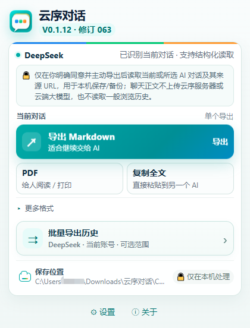

# Yunxu Chat / 云序对话

[**English**](#english) · [**简体中文**](#简体中文)

## English

> **Batch export, download, and organize your AI chat history.**  
> A local-first browser extension for personal backup, long-term archiving, migration, and AI-to-AI handoff.

### Official installation

**Microsoft Edge Add-ons (recommended)**

https://microsoftedge.microsoft.com/addons/detail/%E4%BA%91%E5%BA%8F%E5%AF%B9%E8%AF%9D/ocajiicbeobafcgipegofnpkjfdgnfjf

Yunxu Chat has been published on Microsoft Edge Add-ons. For most Edge users, the official store build is the recommended installation path and can receive future store updates.

### Product screenshot

  

Yunxu Chat V0.1.12 · Revision 063 — real extension UI. The screenshot is currently in Simplified Chinese; the extension also includes an English UI.

From the extension popup, users can export the current conversation to **Markdown**, prepare a **PDF/print** view, **copy the full conversation**, or open **Batch Export History** for supported platforms.

### What does Yunxu Chat do?

Yunxu Chat is designed to turn AI conversations into local files that you can keep and manage yourself.

On **supported AI platforms with reliable batch capability**, you can explicitly choose an export range and authorize the current AI site, then process multiple historical conversations without opening, copying, and saving every chat one by one.

Key capabilities:

- **Batch export AI chat history**
- **Package multiple conversations into a ZIP download**
- Export the current conversation as **Markdown / JSON**
- Generate a browser-native printable page for **Save as PDF**
- **Copy organized Markdown**
- Maintain **one local file per conversation** for long-term archiving
- Update existing local Markdown / JSON archives when a conversation grows
- Organize long conversations and clearly report when completeness cannot be confidently verified
- Save through the browser Downloads folder or a local folder explicitly authorized by the user
- Built-in **English and Simplified Chinese** interface

> Batch capability depends on the current reliable integration available for each AI platform. Yunxu Chat does **not** claim that every platform supports batch export.

### Why Yunxu Chat?

AI conversations are increasingly becoming long-term personal knowledge. The difficult part is often not having one conversation, but keeping control of many of them:

- How do I back up many historical chats at once?
- How do I keep important conversations as ordinary local files?
- How do I maintain an archive instead of leaving everything inside one website?
- How do I move useful conversations into another AI workflow?
- How do I keep my own copy before a website changes?

Yunxu Chat aims to make that workflow clear, user-controlled, and centered on local files.

### Local-first privacy

Yunxu Chat reads the current or explicitly selected AI conversations only when you actively start an export, copy, PDF, or batch task.

For supported structured batch reads, the extension may make same-origin, read-only requests inside the AI website where you are already signed in and have explicitly granted access.

- Conversation content is processed on your device
- Conversation content is not uploaded to Yunxu Chat servers
- No advertising profiling
- Conversation data is not sold
- No OpenAI, Anthropic, Google, or other cloud LLM API is used to process your chat content
- Passwords, cookies, and tokens are not uploaded to the developer
- AI sites are not scanned in the background when you have not started a task
- Yunxu Chat does not read your general browsing history

See the full privacy policy for details.

### Official links

- **Product website:** https://qindagui.github.io/Yunxu-Chat/
- **Microsoft Edge Add-ons:** https://microsoftedge.microsoft.com/addons/detail/%E4%BA%91%E5%BA%8F%E5%AF%B9%E8%AF%9D/ocajiicbeobafcgipegofnpkjfdgnfjf
- **Privacy Policy:** https://qindagui.github.io/Yunxu-Chat/privacy.html
- **Support:** https://qindagui.github.io/Yunxu-Chat/support.html

### Support

Please use the support page if you encounter issues such as:

- Batch export cannot start
- History enumeration is incomplete
- ZIP is not generated or download fails
- An AI website update breaks extraction
- A long single conversation is incomplete
- Markdown / JSON / PDF output is unexpected
- Feature or compatibility suggestions

Support: https://qindagui.github.io/Yunxu-Chat/support.html

For privacy, please do not send passwords, cookies, tokens, verification codes, private keys, or a complete sensitive chat history in a support request.

### Independent product notice

Yunxu Chat is independently developed. It is not affiliated with, endorsed by, authorized by, or officially connected to ChatGPT, Claude, Gemini, DeepSeek, or their respective providers. Third-party names are used only to describe compatibility, and all trademarks belong to their respective owners.

---

## 简体中文

> **批量导出、下载并整理 AI 聊天记录。**  
> 面向个人备份、长期归档、迁移和跨 AI 继续使用的本地优先浏览器扩展。

### 官方安装

**Microsoft Edge Add-ons（推荐）**

https://microsoftedge.microsoft.com/addons/detail/%E4%BA%91%E5%BA%8F%E5%AF%B9%E8%AF%9D/ocajiicbeobafcgipegofnpkjfdgnfjf

云序对话已通过 Microsoft Edge Add-ons 审核并正式发布。普通 Edge 用户建议直接从官方扩展商店安装，以便获得更方便的安装与后续更新。

### 软件界面

  

云序对话 V0.1.12 · 修订 063 实际扩展界面。截图当前为简体中文；扩展同时内置 English 界面。

从扩展主界面可以直接完成当前对话的 **Markdown 导出、PDF 打印、复制全文**；需要备份较多历史记录时，可进入 **“批量导出历史”**。

### 它能做什么？

云序对话的核心用途，是把 AI 聊天记录从网页中整理并保存到你自己的电脑。

对于**具备可靠批量能力的受支持 AI 平台**，你可以在明确选择导出范围并授权当前 AI 站点后，一次处理多个历史会话，而不必逐条打开、逐条复制和手动保存。

主要能力：

- **批量导出 AI 历史聊天记录**
- **将多个会话整理为 ZIP 下载**
- 将当前对话导出为 **Markdown / JSON**
- 生成适合浏览器打印、**保存为 PDF** 的页面
- **复制整理后的 Markdown 全文**
- 支持“一段聊天一个本地文件”的长期归档
- 对已有本地 Markdown / JSON 归档进行后续更新
- 对长对话进行整理，并在无法充分确认完整性时明确提示
- 可使用浏览器下载目录，或由用户主动授权固定本机文件夹
- 内置 **简体中文和 English** 界面

> 批量能力取决于各 AI 平台当前可可靠支持的读取方式。云序对话不会把“所有平台都支持批量导出”作为承诺。

### 为什么做云序对话？

AI 对话越来越像个人的长期资料库，但很多时候，真正困难的不是“聊一次”，而是：

- 怎样一次备份很多历史聊天？
- 怎样把重要对话保存成普通本地文件？
- 怎样长期整理，而不是被锁在某一个网页里？
- 怎样把已有聊天迁移给另一个 AI 继续使用？
- 怎样在网站发生变化之前，保留属于自己的内容副本？

云序对话希望把这些操作尽量变成一个清晰、可控、以本地文件为中心的流程。

### 本地优先与隐私

云序对话只有在你主动执行导出、复制、PDF 或批量任务时，才读取当前或你明确选择的 AI 对话。

对于支持结构化批量读取的平台，扩展可能在你当前已经登录并明确授权的 AI 网站内发起同源只读请求，用于读取你选择导出的历史会话。

- 聊天正文在用户设备本机处理
- 不上传到云序对话服务器
- 不用于广告或用户画像
- 不出售聊天数据
- 不接入 OpenAI、Anthropic、Google 或其他云端大模型 API 来处理聊天正文
- 不会把密码、Cookie、Token 等登录凭据上传给开发者
- 用户未启动任务时，不后台扫描 AI 网站
- 不读取一般浏览历史

完整隐私说明请查看正式隐私政策。

### 正式页面

- **产品主页：** https://qindagui.github.io/Yunxu-Chat/
- **Microsoft Edge Add-ons：** https://microsoftedge.microsoft.com/addons/detail/%E4%BA%91%E5%BA%8F%E5%AF%B9%E8%AF%9D/ocajiicbeobafcgipegofnpkjfdgnfjf
- **隐私政策：** https://qindagui.github.io/Yunxu-Chat/privacy.html
- **帮助与支持：** https://qindagui.github.io/Yunxu-Chat/support.html

### 反馈与支持

遇到以下情况时，欢迎通过支持页面反馈：

- 批量导出无法开始
- 历史会话枚举不完整
- ZIP 未生成或下载失败
- 某个 AI 网站更新后无法读取
- 单个长对话导出不完整
- Markdown / JSON / PDF 结果异常
- 功能建议或新的平台兼容需求

支持页面：https://qindagui.github.io/Yunxu-Chat/support.html

为了保护隐私，请不要在反馈中发送密码、Cookie、Token、验证码、私钥或完整的敏感聊天记录。

### 独立开发声明

云序对话为独立开发的软件，与 ChatGPT、Claude、Gemini、DeepSeek 等第三方 AI 平台不存在隶属、授权、认可或官方合作关系。相关第三方名称仅用于说明兼容场景，各商标归其相应权利人所有。

---

**Yunxu Chat / 云序对话 — Batch export, download, and organize your AI chat history. / 批量导出、下载并整理你的 AI 聊天记录。**
